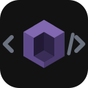

<p align="center">
  
</p>

# @mugenlabs/msw-devtools

A [TanStack DevTools](https://tanstack.com/devtools) plugin for managing [MSW](https://mswjs.io/) (Mock Service Worker) mocks in the browser. Register your existing MSW handlers, then toggle, customize, and inspect them from a visual panel -- no changes to your handler code required.

> **Note:** This project is a work in progress -- the API has not been finalised yet, which is why we haven't reached 1.0.0. Expect breaking changes between minor versions.

<p align="center">
  
</p>

## Features

- **Toggle Mocks** -- Enable or disable individual mock handlers on the fly
- **Switch Variants** -- Swap between response variants (success, error, empty, custom)
- **Live Overrides** -- Edit JSON response bodies, status codes, headers, and delays in real time
- **LIVE Tracking** -- See which operations have been intercepted by MSW on the current page
- **Filter & Sort** -- Filter by type (REST/GraphQL), status (enabled/live), and sort alphabetically
- **Auto Refetch** -- Adapters for TanStack Query, SWR, URQL, Apollo Client, and RTK Query trigger automatic refetches when mock config changes (Axios has no cache to invalidate -- use `useMockRefetch` instead)
- **Persisted State** -- All settings (enabled mocks, variants, overrides, filters) persist across page refreshes

## Packages

Everything ships in a single package. Adapters are available via subpath exports and are tree-shakeable.

| Import path                           | Description                                                                 |
| ------------------------------------- | --------------------------------------------------------------------------- |
| `@mugenlabs/msw-devtools`                         | Registry, store, MSW integration, React UI plugin, adapter system           |
| `@mugenlabs/msw-devtools/types`                   | Type-only entry point (no runtime code)                                     |
| `@mugenlabs/msw-devtools/adapters/tanstack-query` | Auto-refetch via query invalidation                                         |
| `@mugenlabs/msw-devtools/adapters/urql`           | Auto-refetch via custom exchange                                            |
| `@mugenlabs/msw-devtools/adapters/swr`            | Auto-refetch via global mutate                                              |
| `@mugenlabs/msw-devtools/adapters/apollo`         | Auto-refetch via refetchQueries                                             |
| `@mugenlabs/msw-devtools/adapters/rtk-query`      | Auto-refetch via resetApiState                                              |
| `@mugenlabs/msw-devtools/adapters/axios`          | Registration marker for Axios users (use `useMockRefetch` for live updates) |

## Installation

```bash
npm install @mugenlabs/msw-devtools
```

### Peer dependencies

| Dependency | Version | Required |
| --- | --- | --- |
| `msw` | `^2.0.0` | Yes |
| `react` | `^18.0.0 \|\| ^19.0.0` | Yes |
| `react-dom` | `^18.0.0 \|\| ^19.0.0` | Yes |
| `zustand` | `^5.0.0` | Yes |
| `@tanstack/react-query` | `^5.0.0` | Only if using TanStack Query adapter |
| `@urql/core` + `wonka` | `^5.0.0 \|\| ^6.0.0` / `^6.0.0` | Only if using URQL adapter |
| `swr` | `^2.0.0` | Only if using SWR adapter |
| `@apollo/client` + `graphql` | `^3.0.0 \|\| ^4.0.0` / `^16.0.0 \|\| ^17.0.0` | Only if using Apollo adapter |
| `@reduxjs/toolkit` | any | Only if using RTK Query adapter (typed structurally, no peer needed) |
| `@tanstack/react-devtools` | `>=0.9.0` | Optional — only needed to host the panel |

## Quick Start

This guide assumes you already have MSW installed and `mockServiceWorker.js` generated in your public directory.

### 1. Register your MSW handlers

Use `registerRestMocks` and `registerGraphqlMocks` to register your existing MSW handlers with the devtools. Operation metadata (method, path, operation name) is automatically derived from handler info.

```ts
// mocks/setup.ts
import { registerRestMocks, registerGraphqlMocks } from "@mugenlabs/msw-devtools";
import { http, HttpResponse, graphql } from "msw";

// REST -- pass your HttpHandler directly
registerRestMocks(
  { handler: http.get("/api/users", () => HttpResponse.json({ users: [] })) },
  { handler: http.get("/api/posts", () => HttpResponse.json({ posts: [] })), group: "Blog" },
);

// GraphQL -- with multiple variants
registerGraphqlMocks({
  group: "Users",
  variants: [
    graphql.query("GetUser", () =>
      HttpResponse.json({ data: { user: { id: 1, name: "John" } } })
    ),
    {
      handler: graphql.query("GetUser", () =>
        HttpResponse.json({ data: { user: null } })
      ),
      label: "Not Found",
    },
  ],
});
```

### 2. Mount the plugin

```tsx
// App.tsx
import { TanStackDevtools } from "@tanstack/react-devtools";
import { createMswDevToolsPlugin } from "@mugenlabs/msw-devtools";
import "./mocks/setup";

function App() {
  return (
    <>
      <YourApp />
      <TanStackDevtools plugins={[createMswDevToolsPlugin()]} />
    </>
  );
}
```

The MSW service worker starts automatically when the plugin mounts.

> **Custom worker options:** If you need to customise the worker (e.g. a different `serviceWorkerUrl`), call `startWorker()` before the plugin mounts. The plugin detects an already-running worker and skips auto-start.
>
> ```ts
> import { startWorker } from "@mugenlabs/msw-devtools";
> void startWorker({ serviceWorkerUrl: "/custom-path/mockServiceWorker.js" });
> ```

### 3. (Optional) Register an adapter for auto-refetch

Adapters automatically refetch/revalidate queries when you change mock configuration in the devtools panel.

**TanStack Query:**

```ts
import { registerAdapter } from "@mugenlabs/msw-devtools";
import { createTanStackQueryAdapter } from "@mugenlabs/msw-devtools/adapters/tanstack-query";
import { QueryClient } from "@tanstack/react-query";

const queryClient = new QueryClient();
registerAdapter(createTanStackQueryAdapter(queryClient));
```

**URQL:**

```ts
import { registerAdapter } from "@mugenlabs/msw-devtools";
import { createUrqlAdapter, mockRefetchExchange } from "@mugenlabs/msw-devtools/adapters/urql";
import { createClient, cacheExchange, fetchExchange } from "@urql/core";

registerAdapter(createUrqlAdapter());

const client = createClient({
  url: "/graphql",
  exchanges: [cacheExchange, mockRefetchExchange, fetchExchange],
});
```

**SWR:**

```tsx
import { useEffect } from "react";
import { registerAdapter } from "@mugenlabs/msw-devtools";
import { createSwrAdapter } from "@mugenlabs/msw-devtools/adapters/swr";
import { useSWRConfig } from "swr";

function SetupAdapter() {
  const { mutate } = useSWRConfig();
  useEffect(() => {
    const unregister = registerAdapter(createSwrAdapter(mutate));
    return unregister;
  }, [mutate]);
  return null;
}
```

**Apollo Client:**

```ts
import { registerAdapter } from "@mugenlabs/msw-devtools";
import { createApolloAdapter } from "@mugenlabs/msw-devtools/adapters/apollo";

const apolloClient = new ApolloClient({ uri: "/graphql", cache: new InMemoryCache() });
registerAdapter(createApolloAdapter(apolloClient));
```

**RTK Query:**

```ts
import { registerAdapter } from "@mugenlabs/msw-devtools";
import { createRtkQueryAdapter } from "@mugenlabs/msw-devtools/adapters/rtk-query";
import { store } from "./store";
import { pokemonApi } from "./pokemon-api";

registerAdapter(createRtkQueryAdapter(store, pokemonApi));
```

**Axios / plain fetch:**

Axios has no built-in query cache. Register the adapter as a marker and use `useMockRefetch` in your components:

```ts
import { registerAdapter } from "@mugenlabs/msw-devtools";
import { createAxiosAdapter } from "@mugenlabs/msw-devtools/adapters/axios";

registerAdapter(createAxiosAdapter());
```

Registration returns type-safe **operation handles**. Destructure them and pass a handle to `useMockRefetch` instead of hard-coding operation-name strings (typos silently no-op):

```tsx
import { registerRestMocks, useMockRefetch } from "@mugenlabs/msw-devtools";

const [users] = registerRestMocks({ handler: http.get("/api/users", resolver) });

function UserCard() {
  const { data, refetch } = useMyFetch("/api/users/1");
  useMockRefetch(users, refetch); // typo-proof — raw strings like "GET /api/users" also still work
  // With explicit operationNames, handles["GET Users"] is typed and handles["typo"] fails to compile
  return <div>{data?.name}</div>;
}
```

> **Tip:** If you're starting a new project, consider using a server-state library like [TanStack Query](https://tanstack.com/query), [SWR](https://swr.vercel.app/), or [Apollo Client](https://www.apollographql.com/docs/react/) instead of plain `fetch()` or Axios. These libraries provide built-in caching, deduplication, and automatic refetching, and their adapters integrate seamlessly with `@mugenlabs/msw-devtools` without needing per-operation `useMockRefetch` calls.

## Handler Registration Patterns

### Single handler (auto-derived name)

The operation name is derived from the handler info (e.g. `GET /api/users`):

```ts
registerRestMocks({ handler: http.get("/api/users", resolver) });
```

### Custom operation name and group

```ts
registerRestMocks({
  handler: http.get("https://api.example.com/users", resolver),
  operationName: "GET Users",
  group: "User Management",
});
```

### Multiple variants with labels

Provide an array of `variants` instead of a single `handler`. Each variant is either a bare handler or `{ handler, label }`:

```ts
registerGraphqlMocks({
  group: "Users",
  variants: [
    graphql.query("GetUser", successResolver),                        // label: "Default"
    { handler: graphql.query("GetUser", emptyResolver), label: "Empty" },
    { handler: graphql.query("GetUser", errorResolver), label: "Error" },
  ],
});
```

## API Reference

### Core Exports (`@mugenlabs/msw-devtools`)

| Export | Description |
| --- | --- |
| `registerRestMocks(...defs)` | Register REST mock handlers. Metadata is auto-derived from `HttpHandler` info. Returns `OperationHandlesFor<typeof defs>`. |
| `registerGraphqlMocks(...defs)` | Register GraphQL mock handlers. Metadata is auto-derived from `GraphQLHandler` info. Returns `OperationHandlesFor<typeof defs>`. |
| `registerAdapter(adapter)` | Register a data-fetching adapter for auto-refetch. Returns an unregister function. |
| `createMswDevToolsPlugin(options?)` | Create the TanStack DevTools plugin config object. |
| `useMockRefetch(operation, refetch)` | React hook that auto-refetches when mock config changes for a specific operation. Accepts an `OperationHandle` (recommended) or a raw operation-name string. |
| `startWorker(options?)` | Manually start the MSW service worker. |
| `stopWorker()` | Stop the worker and detach the devtools from it. Registered mocks and persisted config are kept. |
| `getWorker()` | Get the current MSW `SetupWorker` instance (or `null`). |
| `mockRegistry` | Singleton registry instance (subscribe, get, unregister). |
| `useMockStore` | Zustand store hook for mock operation state. |
| `mockStore` | Direct Zustand store reference (non-hook). |

### Adapter Exports

| Import path | Export | Description |
| --- | --- | --- |
| `@mugenlabs/msw-devtools/adapters/tanstack-query` | `createTanStackQueryAdapter(queryClient)` | TanStack Query adapter |
| `@mugenlabs/msw-devtools/adapters/urql` | `createUrqlAdapter()` | URQL adapter |
| `@mugenlabs/msw-devtools/adapters/urql` | `mockRefetchExchange` | URQL exchange for mock-triggered re-execution |
| `@mugenlabs/msw-devtools/adapters/swr` | `createSwrAdapter(mutate)` | SWR adapter |
| `@mugenlabs/msw-devtools/adapters/apollo` | `createApolloAdapter(apolloClient)` | Apollo Client adapter |
| `@mugenlabs/msw-devtools/adapters/apollo` | `ApolloClientLike` | Structural type for the subset of `ApolloClient` the adapter needs |
| `@mugenlabs/msw-devtools/adapters/rtk-query` | `createRtkQueryAdapter(store, api)` | RTK Query adapter (resets the API state) |
| `@mugenlabs/msw-devtools/adapters/axios` | `createAxiosAdapter()` | Axios adapter (use with `useMockRefetch`) |

### Key Types

| Type | Description |
| --- | --- |
| `RestMockDef` | Input for `registerRestMocks` -- `{ handler?, variants?, operationName?, group? }` |
| `GraphqlMockDef` | Input for `registerGraphqlMocks` -- `{ handler?, variants?, operationName?, operationType?, group? }` |
| `OperationHandle` | Type-safe reference to a registered operation -- `{ operationName }`. Pass to `useMockRefetch`. |
| `OperationHandlesFor<Defs>` | Return type of the register functions: a tuple of `OperationHandle`s also indexable by `operationName`. Keys are literal when every def has an explicit `operationName`, so `handles["typo"]` is a type error. |
| `OperationHandles` | The untyped form: `OperationHandle[]` indexable by any string. |
| `HandlerVariant` | A resolved variant stored in the registry -- `{ handler, id, label, options? }` |
| `HandlerVariantInput<H>` | What you pass as a variant: a bare handler or `{ handler, label }` |
| `RestMockDescriptor` | Internal descriptor for a registered REST operation -- `{ type: "rest", method, path: string \| RegExp, operationName, group?, variants }` |
| `GraphQLMockDescriptor` | Internal descriptor for a registered GraphQL operation -- `{ type: "graphql", operationName, graphqlOperationName, operationType, endpoint, group?, variants }`. `graphqlOperationName` is what the handler matches on; `operationName` is the display name |
| `MockOperationDescriptor` | Union of `RestMockDescriptor` and `GraphQLMockDescriptor` |
| `OperationMockConfig` | Per-operation runtime state (enabled, active variant, overrides) |
| `MswDevToolAdapter` | Interface for creating custom adapters |
| `MockChangeType` | `"toggle" \| "variant" \| "json-override" \| "status-override" \| "headers-override" \| "enable-all" \| "disable-all"` |
| `ALL_OPERATIONS` | Sentinel `operationName` (`"*"`) carried by bulk `enable-all` / `disable-all` events. Use `affectsOperation(event, name)` in custom adapters to match it. |
| `WorkerOptions` | Configuration for `startWorker()` |
| `MswDevToolsPluginOptions` | Configuration for `createMswDevToolsPlugin()` |

## Documentation

Full documentation and live playground: [https://msw-devtools.mugenlabs.dev/](https://msw-devtools.mugenlabs.dev/)

## Development

```bash
# Install dependencies
pnpm install

# Build all packages
pnpm build

# Run the demo app
pnpm dev:demo

# Type checking (builds first, then checks packages/core and apps/demo)
pnpm typecheck

# Unit tests
pnpm test:ci

# Storybook interaction tests
pnpm test-storybook

# Lint and format
pnpm lint:fix

# E2E tests (Playwright)
pnpm test:e2e
```

### Project Structure

```
msw-devtool/
  apps/
    demo/              # Demo application & documentation site
  packages/
    core/              # Core library (registry, store, MSW integration, UI plugin, adapters)
  e2e/                 # Playwright E2E tests
  scripts/             # Utility scripts (e.g. OG image generation)
```

### Tech Stack

- **pnpm workspaces** for monorepo management
- **MSW v2** for request interception
- **TanStack DevTools** plugin system for the UI panel
- **Zustand v5** for state management (with persist middleware)
- **tsup** for building (ESM-only output)
- **Biome** for linting and formatting

## License

MIT
